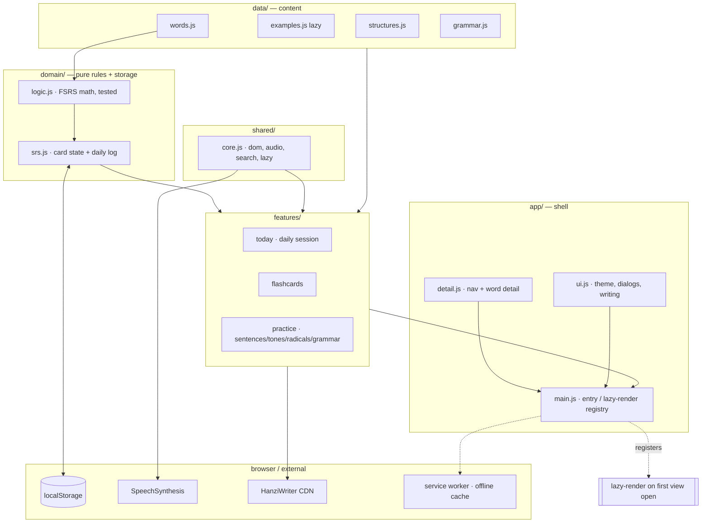

# 汉字记忆 · Character Memory Lab

A spaced-repetition web app for learning Chinese characters, built around how
memory actually works: active recall, interleaving, and an FSRS scheduler that
shows each word at the moment you're about to forget it.

[](https://github.com/sanlong-15/chinese-memory-lab/actions/workflows/test.yml)


**Live:** https://sanlong-15.github.io/chinese-memory-lab/

> 1,331 words (HSK 1–4, Boya L11–L14, GCP7 L6). Every character is broken into
> its parts with an honest memory story. Works offline once installed.

---

## Why this project exists

Most flashcard apps test recognition ("do you know this word?") but not
production ("can you produce it?"), and they schedule reviews with crude
fixed intervals. Character Memory Lab is an experiment in doing the learning
science properly in a tiny, dependency-light codebase:

- **Active recall + production**, not just multiple choice.
- **FSRS scheduling** (stability + difficulty per card), not SM-2 guesswork.
- **Interleaving** — one daily session mixes recognition, recall, listening,
  tone, and sentence tasks instead of drilling one mode.
- **Character decomposition** — every word links to a per-character story so
  you learn the building blocks, not opaque glyphs.

## Features

- One-tap daily session that picks the right task per word from its memory state
- FSRS spaced repetition with honest retention estimates on the Progress screen
- Listening, tone (with contour glyphs), sentence-cloze, and handwriting practice
- Character structure, radical, and sound-family reference views
- Backup / restore of all progress (local, no account)
- Installable PWA with full offline study
- Light / dark "Warm Stone" theme, keyboard shortcuts, reduced-motion support

## Architecture

No framework, no bundler. Plain ES scripts loaded in dependency order, organised
by layer and feature — most-pure at the top, most-UI at the bottom.



Full write-up: [`docs/ARCHITECTURE.md`](docs/ARCHITECTURE.md).

## Key engineering decisions (and their trade-offs)

- **No build step.** Classic `<script>` tags sharing global scope. Trade-off:
  no `import`/tree-shaking, but the app runs by double-clicking `index.html`,
  deploys to static hosting with zero pipeline, and has nothing to break in a
  toolchain. For a solo, static app this is the right amount of tooling.
- **Pure domain layer.** All FSRS math lives in `domain/logic.js` with no DOM
  and full unit tests, so the scheduler is verifiable in isolation. See
  [`docs/TESTING.md`](docs/TESTING.md).
- **Lazy-rendered views.** Only "Today" renders at load; other views build on
  first open. This cut startup DOM from ~9,000 nodes to a few hundred. See
  [`docs/PERF-AUDIT.md`](docs/PERF-AUDIT.md).
- **Offline-first PWA.** A service worker precaches the app shell and
  runtime-caches data, so study works with no connection. HTML is fetched
  network-first to avoid stale-locking users on an old build.

## Run it locally

No install needed to *use* it — just open `index.html`. To run the tooling:

```bash
npm install
npm test        # vitest unit tests (FSRS logic + data integrity)
npm run lint    # eslint
npm run format  # prettier
```

## Testing

A pragmatic pyramid: fast unit tests on the pure logic, a headless load-smoke
harness for the wired app, and manual verification for DOM/interaction. Full
rationale (including what is deliberately *not* tested) in
[`docs/TESTING.md`](docs/TESTING.md).

## Project structure

```
js/
  data/       words, examples (lazy), structures, grammar
  domain/     logic (FSRS, tested) · srs (state + daily log)
  shared/     core (dom, audio, search, lazy loader) · logger · errors
  features/   today · flashcards · practice · upload
  app/        detail (nav) · ui (shell) · main (entry) · analytics
css/          style.css (Warm Stone theme, light + dark)
docs/         architecture, testing, deploy, product + design docs
sw.js         service worker (offline)
manifest.webmanifest
```

## Roadmap

See [`docs/ROADMAP.md`](docs/ROADMAP.md). Near-term: dedupe shared UI helpers,
split the multi-feature files, and add end-to-end tests.

## License

[MIT](LICENSE) © Koko
